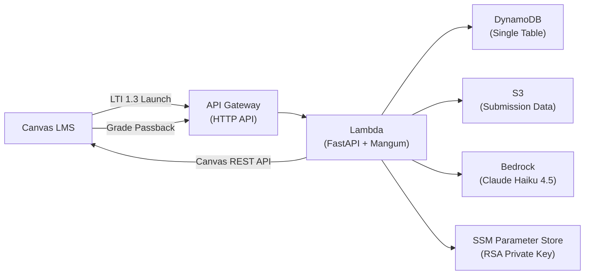
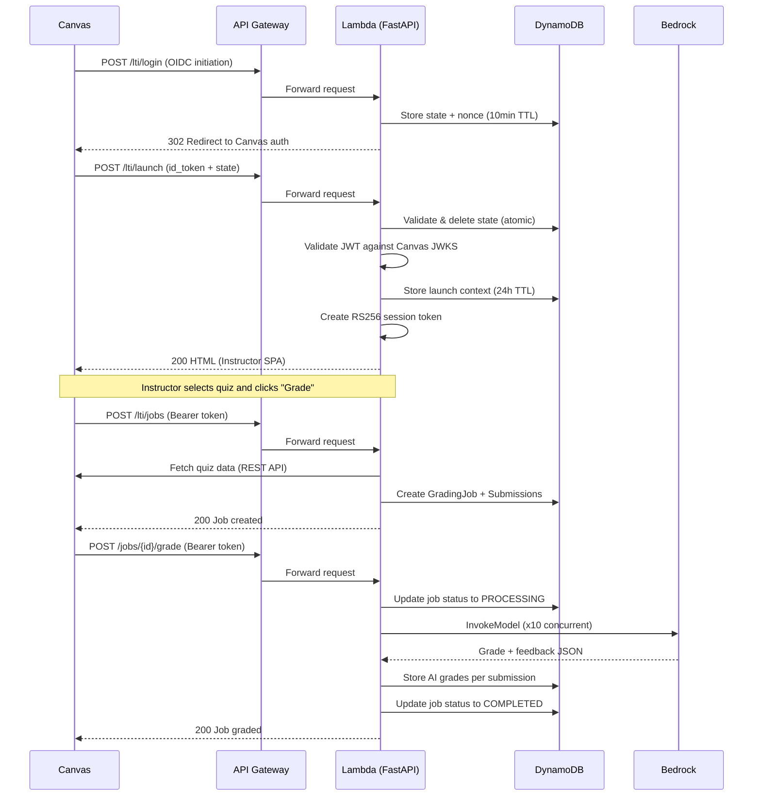
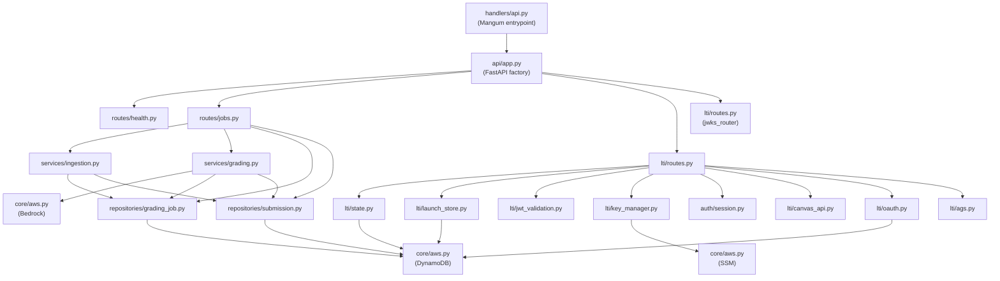

# Architecture

The AI Grading Helper is a serverless application running on AWS, designed to integrate with Canvas LMS via LTI 1.3 and use AWS Bedrock for AI-powered grading of student submissions.

This page covers the system design, component breakdown, and key architectural patterns.

## System Overview

The service runs as a single AWS Lambda function behind an API Gateway HTTP API. FastAPI handles routing inside the Lambda via Mangum. All persistent state lives in a single DynamoDB table using a single-table design pattern. Student submission data passes through S3, and AI grading calls go to AWS Bedrock.

Canvas LMS connects to the service through two integration points: LTI 1.3 (for launching the tool inside Canvas and passing grades back) and the Canvas REST API (for fetching quiz data on behalf of the instructor).

## Request Lifecycle

Here is what happens when an instructor launches the tool from Canvas and grades a quiz:

## Source Layer Architecture

The codebase follows a layered architecture. Requests flow from the Lambda handler through FastAPI routing, into service logic, and down to repository and AWS client layers.

## Component Breakdown

### Lambda Function

- **Runtime:** Python 3.13 on arm64 (Graviton2 — 20% cheaper than x86)
- **Timeout:** 300 seconds (accommodates concurrent Bedrock calls during grading)
- **Memory:** 512 MB
- **Handler:** Mangum wraps FastAPI, strips the `/{stage}` prefix from API Gateway paths before FastAPI routing sees them
- **Build:** Custom Makefile cross-compiles native dependencies with `--platform manylinux2014_aarch64`

### API Gateway

- **Type:** HTTP API (cheaper and faster than REST API)
- **Throttling:** 5 requests/second, burst limit of 10
- **CORS:** Configurable origin, allows GET/POST/OPTIONS with Content-Type and Authorization headers
- **Routing:** Catch-all `/{proxy+}` sends everything to the single Lambda

### DynamoDB

- **Billing:** PAY_PER_REQUEST (no provisioned capacity — good for unpredictable academic workloads)
- **Design:** Single-table with composite `pk`/`sk` keys — all entity types share one table
- **GSIs:** Two global secondary indexes (GSI1 for course-based queries, GSI2 for status-based queries)
- **TTL:** Enabled on the `ttl` attribute for automatic cleanup of LTI state (10 min), launch context (24h), and OAuth tokens
- See [Data Models](../data-models/index.md) for the full key schema

### S3

- **Encryption:** AES-256 server-side encryption
- **Public access:** Fully blocked (all four public access settings enabled)
- **Lifecycle:** Objects under `batch/` prefix auto-expire after 90 days

### Bedrock

- **Model:** `anthropic.claude-haiku-4-5-20251001-v1:0` (Claude Haiku 4.5 — fast and cost-effective for grading)
- **API version:** `bedrock-2023-05-31` (fixed required string)
- **Concurrency:** `ThreadPoolExecutor` with 10 workers for parallel grading within a single job
- **Auth:** IAM-based (no API key needed — Lambda's execution role has `bedrock:InvokeModel` permission)

### SSM Parameter Store

- **Parameter:** `/grading-helper/lti-private-key` (SecureString)
- **Purpose:** Stores the RSA private key used for signing JWTs (session tokens and AGS assertions)
- **Fallback:** The key can also be set directly via the `LTI_PRIVATE_KEY` environment variable (useful for local dev)

## Key Architectural Patterns

### Single-Table DynamoDB

All entities (GradingJob, Submission, LTI State, Launch Context, Canvas Token) live in one table. This reduces the number of AWS resources to manage and keeps costs down. Each entity type has a distinct `pk`/`sk` pattern so they never collide. See [Data Models](../data-models/index.md) for the full schema.

### Cookieless JWT Sessions

Canvas embeds the tool in an iframe, and many browsers block third-party cookies in iframes. Instead of session cookies, the service uses RS256 JWT Bearer tokens. The LTI launch handler creates a signed token and passes it to the instructor SPA, which includes it in `Authorization: Bearer <token>` headers on subsequent API calls.

### Mangum Path Stripping

API Gateway adds a `/{stage}` prefix (e.g., `/dev`) to all paths. Mangum strips this prefix via `api_gateway_base_path=f"/{stage}"` so that FastAPI routes are defined without the stage prefix. This means `GET /health` works both locally and behind API Gateway.

### Dependency Injection for Testability

All repository classes accept an optional `table=` constructor argument. In production, they lazily create the DynamoDB table resource via `get_dynamodb_table()`. In tests, the moto-mocked table is injected directly. This avoids patching boto3 globally and makes tests fast and deterministic.

### `lru_cache` Settings

`get_settings()`, `get_private_key()`, and `get_public_jwk()` are all `lru_cache`-decorated. They load configuration once and reuse it across requests within the same Lambda invocation. Tests must call `.cache_clear()` on each function after modifying environment variables.
