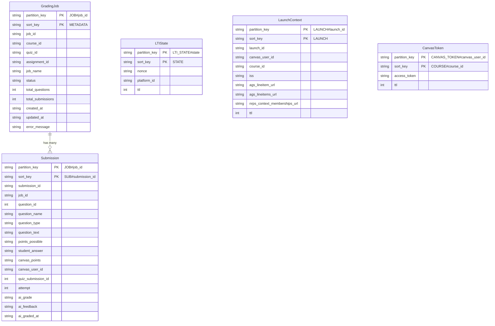

# Data Models

This page documents the DynamoDB table schema, entity key patterns, access patterns, and the Pydantic models used throughout the application.

## DynamoDB Single-Table Design

All entities share a single DynamoDB table with a composite primary key (`pk` + `sk`) and two global secondary indexes. This keeps infrastructure simple (one table to provision and monitor) and lets us co-locate related data for efficient queries.



## Entity Key Reference

| Entity | `pk` | `sk` | GSI1PK | GSI1SK | GSI2PK | GSI2SK | TTL |
|--------|------|------|--------|--------|--------|--------|-----|
| GradingJob | `JOB#{job_id}` | `METADATA` | `COURSE#{course_id}` | `JOB#{created_at}` | `STATUS#{status}` | `JOB#{job_id}` | -- |
| Submission | `JOB#{job_id}` | `SUB#{submission_id}` | -- | -- | -- | -- | -- |
| LTI State | `LTI_STATE#{state}` | `STATE` | -- | -- | -- | -- | 10 min |
| Launch Context | `LAUNCH#{launch_id}` | `LAUNCH` | -- | -- | -- | -- | 24 hours |
| Canvas Token | `CANVAS_TOKEN#{canvas_user_id}` | `COURSE#{course_id}` | -- | -- | -- | -- | Token expiry |

## Access Patterns

| Pattern | Key/Index Used | Code Location |
|---------|---------------|---------------|
| Get job by ID | `pk=JOB#{id}`, `sk=METADATA` | `GradingJobRepository.get()` |
| List jobs by course | GSI1: `GSI1PK=COURSE#{course_id}` | `GradingJobRepository.list_by_course()` |
| List jobs by status | GSI2: `GSI2PK=STATUS#{status}` | `GradingJobRepository.list_by_status()` |
| List submissions for job | `pk=JOB#{job_id}`, `sk begins_with SUB#` | `SubmissionRepository.list_by_job()` |
| Get single submission | `pk=JOB#{job_id}`, `sk=SUB#{sub_id}` | `SubmissionRepository.get()` |
| Validate LTI state | `pk=LTI_STATE#{state}`, `sk=STATE` (atomic delete) | `LTIStateStore.validate()` |
| Get launch context | `pk=LAUNCH#{id}`, `sk=LAUNCH` | `LaunchStore.get()` |
| Get Canvas OAuth token | `pk=CANVAS_TOKEN#{user}`, `sk=COURSE#{course}` | `get_canvas_token()` |

## GSI Design

### GSI1 — Course Queries

- **Partition key:** `GSI1PK` = `COURSE#{course_id}`
- **Sort key:** `GSI1SK` = `JOB#{created_at}` (ISO 8601)
- **Used by:** `list_by_course()` to show all grading jobs for a course, sorted by creation time
- **Projection:** ALL (full item is returned)

### GSI2 — Status Queries

- **Partition key:** `GSI2PK` = `STATUS#{status}`
- **Sort key:** `GSI2SK` = `JOB#{job_id}`
- **Used by:** `list_by_status()` to find jobs in a specific state (PENDING, PROCESSING, COMPLETED, FAILED)
- **Projection:** ALL
- **Note:** When a job's status changes, the repository updates `GSI2PK` in the same `update_item` call so the GSI stays consistent

## Float-as-String Storage

DynamoDB uses Python `Decimal` types for numbers, which causes issues with Pydantic's `float` fields. To avoid conversion headaches, all float values (`points_possible`, `canvas_points`, `ai_grade`) are stored as strings in DynamoDB and converted back to `float` when reading:

```python
# Writing
item["points_possible"] = str(sub.points_possible)

# Reading
points_possible=float(item["points_possible"])
```

## Pydantic Models

### GradingJob

Represents a batch grading run for a quiz. Defined in `src/models/grading_job.py`.

| Field | Type | Description |
|-------|------|-------------|
| `job_id` | `UUID` | Auto-generated unique identifier |
| `course_id` | `str` | Canvas course ID |
| `quiz_id` | `str` | Canvas quiz ID |
| `assignment_id` | `str` | Canvas assignment ID (used for AGS lineitem matching) |
| `job_name` | `str` | Human-readable name |
| `status` | `JobStatus` | `PENDING`, `PROCESSING`, `COMPLETED`, or `FAILED` |
| `total_questions` | `int` | Number of questions in the quiz |
| `total_submissions` | `int` | Number of student submissions |
| `created_at` | `datetime` | UTC timestamp |
| `updated_at` | `datetime` | UTC timestamp, updated on status change |
| `error_message` | `str | None` | Error details if status is FAILED |

### JobStatus

`StrEnum` with four values:

- `PENDING` — job created, waiting to be graded
- `PROCESSING` — Bedrock calls in progress
- `COMPLETED` — all submissions graded successfully
- `FAILED` — one or more submissions failed to grade (error_message has details)

### GradingJobCreate

Request body for `POST /jobs`. Defined in `src/models/grading_job.py`.

| Field | Type | Description |
|-------|------|-------------|
| `course_id` | `str` | Must match session's course_id |
| `quiz_id` | `str` | Canvas quiz ID |
| `job_name` | `str` | Human-readable name |
| `canvas_data` | `dict` | Raw Canvas quiz export data |

### Submission

One student answer to one question. Defined in `src/models/submission.py`.

| Field | Type | Description |
|-------|------|-------------|
| `submission_id` | `UUID` | Auto-generated unique identifier |
| `job_id` | `UUID` | Parent grading job |
| `question_id` | `int` | Canvas question ID |
| `question_name` | `str` | Question name from Canvas |
| `question_type` | `str` | e.g., `short_answer_question`, `fill_in_multiple_blanks_question` |
| `question_text` | `str` | The question prompt |
| `points_possible` | `float` | Maximum points for this question |
| `student_answer` | `str` | The student's response |
| `canvas_points` | `float` | Points Canvas originally assigned |
| `correct_answers` | `list[str]` | Expected correct answers |
| `canvas_user_id` | `str` | Canvas user ID (for grade passback) |
| `quiz_submission_id` | `int` | Canvas quiz submission ID (used for REST-based grade passback; 0 if not set) |
| `attempt` | `int` | Quiz submission attempt number (default 1) |
| `ai_grade` | `float | None` | AI-assigned grade (clamped to 0..points_possible) |
| `ai_feedback` | `str | None` | AI-generated feedback text |
| `ai_graded_at` | `datetime | None` | When the AI grading was performed |

### SessionUser

Decoded session token payload. Defined in `src/auth/session.py`.

| Field | Type | Description |
|-------|------|-------------|
| `launch_id` | `str` | LTI launch context ID |
| `course_id` | `str` | Canvas course ID (used for access control) |
| `canvas_user_id` | `str` | Canvas user ID |

### Canvas Data Models

Defined in `src/models/canvas.py` for parsing Canvas quiz export JSON.

**CanvasQuizExport** — Top-level model grouping questions by type:

- `short_answer_question: list[CanvasQuestion]`
- `fill_in_multiple_blanks_question: list[CanvasQuestion]`
- `all_questions` property returns both lists combined

**CanvasQuestion** — A quiz question with answers and submissions:

| Field | Type |
|-------|------|
| `id` | `int` |
| `quiz_id` | `int` |
| `question_name` | `str` |
| `question_type` | `str` |
| `question_text` | `str` |
| `points_possible` | `float` |
| `answers` | `list[CanvasAnswer]` |
| `submissions` | `list[CanvasSubmission]` |

**CanvasAnswer** — An answer option:

| Field | Type |
|-------|------|
| `id` | `int` |
| `text` | `str` |
| `weight` | `float` |
| `comments` | `str` |
| `blank_id` | `str | None` |

**CanvasSubmission** — A student's submission for a question:

| Field | Type |
|-------|------|
| `answer` | `str` |
| `points` | `float` |
