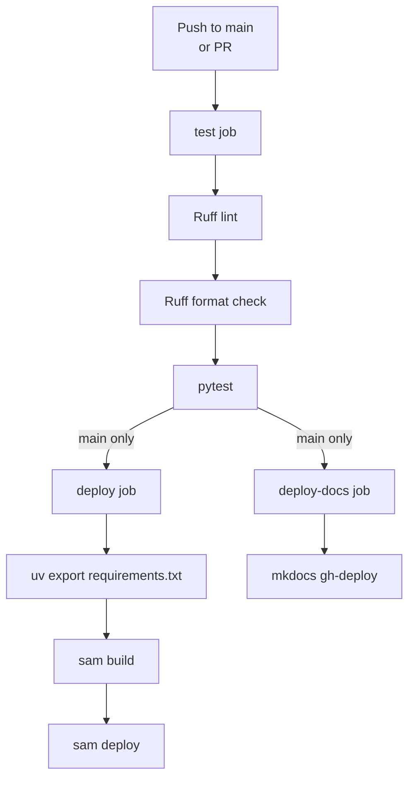

# Deployment

The service deploys to AWS using the Serverless Application Model (SAM). This page covers the infrastructure, build process, CI/CD pipeline, and operational details.

## Infrastructure Overview

SAM creates the following AWS resources from `template.yaml`:

| Resource | Type | Purpose |
|----------|------|---------|
| `ApiGateway` | HTTP API | Routes all requests to Lambda |
| `ApiFunction` | Lambda Function | Runs FastAPI via Mangum (Python 3.13, arm64) |
| `GradingTable` | DynamoDB Table | Single-table for all entities |
| `GradingBucket` | S3 Bucket | Submission data storage |

Additional resources managed outside SAM:

- **SSM Parameter Store** — `/grading-helper/lti-private-key` (RSA private key, SecureString)
- **GitHub Actions** — CI/CD for testing, deploying, and publishing docs

## SAM Parameters

| Parameter | Type | Default | Description |
|-----------|------|---------|-------------|
| `Stage` | String | `dev` | Deployment stage (`dev`, `staging`, `prod`) |
| `BaseUrl` | String | `""` | Public API Gateway URL (avoids CloudFormation circular dep) |
| `BedrockModelId` | String | `anthropic.claude-haiku-4-5-20251001-v1:0` | Bedrock model for AI grading |
| `AllowedOrigin` | String | `*` | CORS allowed origin |
| `LtiIss` | String | `""` | LTI platform issuer URL |
| `LtiClientId` | String | `""` | LTI Developer Key client_id |
| `LtiDeploymentId` | String | `""` | LTI deployment_id |
| `LtiAuthLoginUrl` | String | `""` | Canvas OIDC auth endpoint |
| `LtiAuthTokenUrl` | String | `""` | Canvas OAuth2 token endpoint |
| `LtiKeySetUrl` | String | `""` | Canvas JWKS URL |
| `ApiClientId` | String | `""` | Canvas API Developer Key client_id |
| `ApiClientSecret` | String | `""` | Canvas API Developer Key client_secret |
| `ApiCanvasUrl` | String | `""` | Canvas instance base URL |

These are set in `samconfig.toml` under `parameter_overrides`.

## Build Process

The Lambda uses a custom Makefile for building because native Python packages (like `cryptography`) need to be compiled for the arm64 Lambda runtime, not the local machine.

### Build Steps

```bash
# 1. Export requirements from uv lock file
uv export --no-hashes --no-dev -o requirements.txt

# 2. Build with SAM (uses Makefile internally)
sam build
```

The Makefile does two things:

1. Copies the `src/` directory to the build artifacts directory
2. Installs dependencies with pip using `--platform manylinux2014_aarch64 --only-binary=:all:` to get Linux arm64 wheels

!!! warning "Always export requirements first"
    `sam build` reads from `requirements.txt`, not `pyproject.toml`. If you add a dependency with `uv add`, you must run `uv export` again before building. The CI/CD pipeline does this automatically.

## Manual Deployment

```bash
# Full deploy sequence
uv export --no-hashes --no-dev -o requirements.txt
sam build
sam deploy --no-confirm-changeset
```

`samconfig.toml` stores all deployment settings (stack name, region, parameter overrides), so `sam deploy` doesn't need additional flags.

### First-Time Setup

Before the first deploy, generate and store the RSA private key in SSM:

```bash
# Generate RSA key
openssl genrsa -out key.pem 2048

# Store in SSM as SecureString
aws ssm put-parameter \
  --name "/grading-helper/lti-private-key" \
  --value file://key.pem \
  --type SecureString \
  --region ca-central-1

# Clean up local key
rm key.pem
```

Then set the Canvas LTI parameters in `samconfig.toml`:

```toml
parameter_overrides = "Stage=\"dev\" BaseUrl=\"https://xxx.execute-api.ca-central-1.amazonaws.com/dev\" LtiIss=\"https://canvas.instructure.com\" LtiClientId=\"your-lti-client-id\" ..."
```

## CI/CD Pipeline

GitHub Actions runs on every push to `main` and on pull requests.



### Jobs

| Job | Trigger | What it does |
|-----|---------|-------------|
| `test` | All pushes and PRs | `ruff check`, `ruff format --check`, `pytest` |
| `deploy` | Push to main only | `uv export` -> `sam build` -> `sam deploy` |
| `deploy-docs` | Push to main only | `mkdocs gh-deploy --force` to GitHub Pages |

The `deploy` job requires AWS credentials stored as GitHub repository secrets (`AWS_ACCESS_KEY_ID`, `AWS_SECRET_ACCESS_KEY`) and runs in the `production` environment.

## Environment Variables

All Lambda environment variables are set via SAM template parameters:

| Env Var | Source | Description |
|---------|--------|-------------|
| `TABLE_NAME` | `!Ref GradingTable` | DynamoDB table name |
| `BUCKET_NAME` | `!Ref GradingBucket` | S3 bucket name |
| `STAGE` | `!Ref Stage` | Deployment stage |
| `POWERTOOLS_SERVICE_NAME` | hardcoded | `grading-helper` |
| `BASE_URL` | `!Ref BaseUrl` | Public API URL |
| `BEDROCK_MODEL_ID` | `!Ref BedrockModelId` | Bedrock model ID |
| `LTI_ISS` | `!Ref LtiIss` | Platform issuer |
| `LTI_CLIENT_ID` | `!Ref LtiClientId` | LTI client ID |
| `LTI_DEPLOYMENT_ID` | `!Ref LtiDeploymentId` | LTI deployment ID |
| `LTI_AUTH_LOGIN_URL` | `!Ref LtiAuthLoginUrl` | OIDC auth URL |
| `LTI_AUTH_TOKEN_URL` | `!Ref LtiAuthTokenUrl` | OAuth2 token URL |
| `LTI_KEY_SET_URL` | `!Ref LtiKeySetUrl` | Platform JWKS URL |
| `API_CLIENT_ID` | `!Ref ApiClientId` | Canvas API client ID |
| `API_CLIENT_SECRET` | `!Ref ApiClientSecret` | Canvas API client secret |
| `API_CANVAS_URL` | `!Ref ApiCanvasUrl` | Canvas instance URL |

The RSA private key is **not** set as an env var in the SAM template. The Lambda reads it from SSM at runtime using `SSMParameterReadPolicy`.

## samconfig.toml

This file stores default `sam deploy` settings so you don't have to pass flags every time:

- **Stack name:** `grading-helper-service`
- **Region:** `ca-central-1`
- **Capabilities:** `CAPABILITY_IAM` (Lambda execution role)
- **Parameter overrides:** All the SAM parameters listed above

## IAM Policies

The Lambda function has four IAM policies:

| Policy | Purpose |
|--------|---------|
| `DynamoDBCrudPolicy` | Full CRUD on the `GradingTable` |
| `S3CrudPolicy` | Full CRUD on the `GradingBucket` |
| `SSMParameterReadPolicy` | Read `/grading-helper/lti-private-key` |
| Custom Bedrock statement | `bedrock:InvokeModel` on the configured model ARN |

## Cost and Limits

- **Budget alert:** $25/month (set in AWS Budgets)
- **Lambda concurrency:** 10 total (account-level limit — `ReservedConcurrentExecutions` cannot be used)
- **API Gateway throttle:** 5 requests/second, burst 10
- **DynamoDB:** PAY_PER_REQUEST (no reserved capacity)
- **S3 lifecycle:** Objects under `batch/` expire after 90 days

The service is designed for low-traffic academic use. The throttle limits and pay-per-request billing keep costs minimal during development and early adoption.
