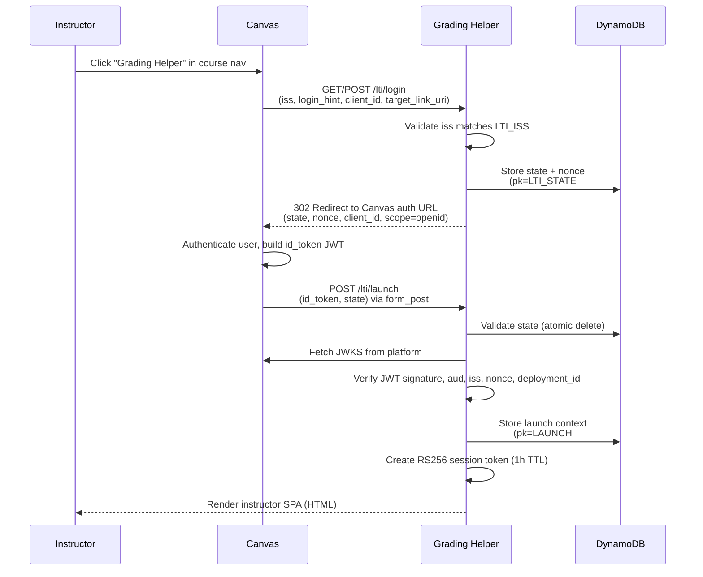
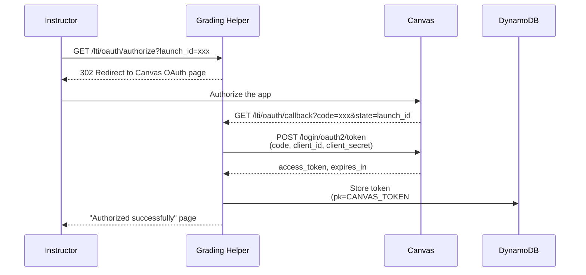

# LTI Integration

This service integrates with Canvas LMS using [LTI 1.3](https://www.imsglobal.org/spec/lti/v1p3/), the current standard for connecting external tools to learning management systems. This page covers the full integration: the OIDC launch flow, key management, state handling, Canvas OAuth2, and grade passback.

## What is LTI 1.3?

LTI (Learning Tools Interoperability) 1.3 is an IMS Global standard that lets external tools embed inside an LMS securely. The tool launches inside a Canvas iframe, receives a signed JWT with the user's identity and course context, and can push grades back to Canvas's gradebook.

Key benefits for this project:

- **Seamless UX** — instructors access the grading tool directly from their Canvas course navigation
- **No separate login** — identity comes from Canvas via OIDC
- **Grade passback** — AI grades flow back into Canvas's gradebook via AGS (Assignment and Grade Services)
- **Course context** — the launch JWT tells us which course, user, and assignment the tool was opened from

## OIDC Launch Flow

LTI 1.3 uses a three-step OIDC flow. Canvas initiates the login, we redirect back with state and nonce, and Canvas posts a signed JWT with the user's identity.



### Step 1: Login Initiation (`GET/POST /lti/login`)

Canvas sends `iss`, `login_hint`, `target_link_uri`, `client_id`, and optionally `lti_message_hint`. The tool validates that `iss` matches the configured `LTI_ISS`, generates a random `state` and `nonce`, stores them in DynamoDB with a 10-minute TTL, and redirects the browser to Canvas's OIDC authorization endpoint.

### Step 2: Canvas Authenticates

Canvas validates the instructor's session, builds a signed `id_token` JWT containing the user's identity, course context, roles, and LTI service URLs (AGS, NRPS). Canvas then form-posts this token back to the tool's launch URL along with the `state`.

### Step 3: Launch Callback (`POST /lti/launch`)

The tool:

1. **Validates state** — atomically deletes the state from DynamoDB (one-time use prevents replay attacks)
2. **Validates the JWT** — verifies the signature against Canvas's JWKS, checks `aud`, `iss`, `exp`, `nonce`, and `deployment_id`
3. **Stores launch context** — saves the course ID, user ID, AGS lineitem URL, and NRPS URL in DynamoDB with a 24-hour TTL
4. **Creates a session token** — signs an RS256 JWT containing `launch_id`, `course_id`, and `canvas_user_id` (1-hour TTL)
5. **Renders the instructor SPA** — returns an HTML page with the session token embedded, ready to make authenticated API calls

## Two Canvas Developer Keys

Canvas requires two separate developer keys for this tool. This was confirmed with the UBC LT Hub team.

### LTI Developer Key

Used for the OIDC launch flow, JWKS verification, and LTI services (AGS, NRPS).

- **Config URL:** `{BASE_URL}/lti/config` — Canvas reads this JSON to auto-populate the key's settings
- **Valid scopes:** Only LTI-namespaced scopes (`https://purl.imsglobal.org/spec/lti-ags/scope/*` and `https://purl.imsglobal.org/spec/lti-nrps/scope/*`)
- **Canvas REST API scopes** (`url:GET|/api/v1/...`) are **not valid** on LTI keys — Canvas rejects them
- Provides: `client_id` and `deployment_id`

### API Developer Key

Used for Canvas REST API access (fetching quizzes, questions, submissions) via OAuth2 Authorization Code flow on behalf of the instructor.

- **Scopes needed:**
    - `url:GET|/api/v1/courses/:course_id/quizzes`
    - `url:GET|/api/v1/courses/:course_id/quizzes/:quiz_id/questions`
    - `url:GET|/api/v1/courses/:course_id/quizzes/:quiz_id/submissions`
    - `url:GET|/api/v1/courses/:course_id/assignments`
    - `url:GET|/api/v1/courses/:course_id/assignments/:assignment_id/submissions`
    - `url:GET|/api/v1/courses/:course_id/discussion_topics`
    - `url:GET|/api/v1/courses/:course_id/discussion_topics/:topic_id/entries`
- Provides: `client_id` and `client_secret`

## JWKS Endpoint

The tool serves its RSA public key at `GET /.well-known/jwks.json`. Canvas uses this to verify JWTs signed by the tool (e.g., AGS client assertions).

Key loading (`src/lti/key_manager.py`):

1. Check the `LTI_PRIVATE_KEY` environment variable for an inline PEM string
2. If empty, fetch from SSM Parameter Store at `/grading-helper/lti-private-key` (SecureString)
3. Derive the public JWK from the private key
4. Both `get_private_key()` and `get_public_jwk()` are `lru_cache`-decorated — loaded once per Lambda cold start

## JWT Validation

`validate_launch_token()` in `src/lti/jwt_validation.py` handles launch JWT verification:

- Fetches the signing key from Canvas's JWKS endpoint (cached per URL)
- Verifies: RS256 signature, `exp`, `iat`, `aud` (must match `client_id`), `iss` (must match `LTI_ISS`)
- Checks `nonce` matches the value stored during login
- Checks `deployment_id` — with a quirk:

### Deployment ID Prefix Handling

Canvas prefixes deployment IDs with an account ID, e.g., `221:your-deployment-id`. The tool stores only the bare deployment ID in its config. The validation code accepts both exact match and prefix match:

```python
if claim_deployment_id != deployment_id and not (
    claim_deployment_id and claim_deployment_id.endswith(f":{deployment_id}")
):
    raise jwt.InvalidTokenError("Deployment ID mismatch")
```

## State Management

### LTI State Store (`src/lti/state.py`)

Manages the OIDC state+nonce pairs between login initiation and launch callback.

| Property | Value |
|----------|-------|
| **DynamoDB key** | `pk=LTI_STATE#{state}`, `sk=STATE` |
| **TTL** | 10 minutes |
| **Validation** | Atomic delete with `ReturnValues="ALL_OLD"` — one-time use |
| **Contents** | `nonce`, `platform_id` |

The atomic delete means that if Canvas somehow posts the launch callback twice, the second attempt gets a clean "invalid state" error. No replay attacks possible.

### Launch Store (`src/lti/launch_store.py`)

Stores the LTI launch context (extracted from the JWT claims) for use by subsequent API calls.

| Property | Value |
|----------|-------|
| **DynamoDB key** | `pk=LAUNCH#{launch_id}`, `sk=LAUNCH` |
| **TTL** | 24 hours |
| **Contents** | `canvas_user_id`, `course_id`, `iss`, `ags_lineitem_url`, `ags_lineitems_url`, `ags_scope`, `nrps_context_memberships_url` |

The launch context is needed later for AGS grade passback (which needs the `ags_lineitem_url` or `ags_lineitems_url`) and for Canvas API calls (which need the `course_id` and `canvas_user_id`).

## Canvas OAuth2 Flow

To access the Canvas REST API (for fetching quiz data), the tool needs an OAuth2 access token on behalf of the instructor. This uses the Authorization Code flow with the API Developer Key.



The token is stored in DynamoDB keyed by `canvas_user_id` and `course_id`, with a TTL matching the token's expiration. Subsequent Canvas API calls retrieve the stored token without re-authorizing.

### OAuth Helpers (`src/lti/oauth.py`)

- `build_auth_url()` — constructs the Canvas authorization URL with `client_id`, `redirect_uri`, and `state` (set to `launch_id`)
- `exchange_code_for_token()` — exchanges the authorization code for an access token at Canvas's token endpoint
- `store_canvas_token()` / `get_canvas_token()` — DynamoDB CRUD for OAuth tokens

## AGS Grade Passback

Assignment and Grade Services (AGS) lets the tool push AI grades back into Canvas's gradebook. This uses the LTI client credentials flow (separate from the Canvas OAuth2 flow above).

### How It Works

1. **Get AGS token** — `get_ags_token()` signs a JWT assertion with the tool's RSA private key and exchanges it at Canvas's token endpoint for a scoped access token
2. **Find or create lineitem** — `find_or_create_lineitem_url()` resolves the gradebook column to post scores to (see below)
3. **Submit scores** — `submit_score()` POSTs each grade to the lineitem's `/scores` endpoint using the AGS content type (`application/vnd.ims.lis.v1.score+json`)
4. **Batch passback** — `passback_job_grades()` looks up the launch context, gets an AGS token, resolves the lineitem, and submits scores for all graded submissions in a job

The AGS token endpoint is the LTI platform's OAuth2 token URL (`LTI_AUTH_TOKEN_URL`), not the Canvas REST API. The `client_assertion` JWT is signed with the same RSA key used for session tokens.

### Lineitem Resolution

AGS line items represent gradebook columns in Canvas. How the tool resolves a lineitem depends on how it was launched:

- **Assignment launches** — Canvas provides a singular `ags_lineitem_url` pointing directly to the gradebook column. The tool uses it as-is.
- **Course navigation launches** — Canvas only provides `ags_lineitems_url` (the collection URL), with no specific lineitem. The tool must find or create one.

`find_or_create_lineitem_url()` handles the course navigation case:

1. Lists existing lineitems via `GET {lineitems_url}` and tries to match by `assignment_id` or `job_name`
2. If no match is found, creates a new lineitem via `POST {lineitems_url}` with `scoreMaximum`, `label`, and `resourceId`

!!! note "Canvas AGS Quirk"
    Canvas does not expose natively-created assignments via the AGS lineitems listing — it returns `[]`. This means the tool always creates a new gradebook column for course navigation launches. This is expected behavior, confirmed on ubcstaging.

## Quiz REST Grade Passback

For quiz-based grading jobs, the tool uses a second passback strategy that preserves MC/true-false grades and avoids creating a new gradebook column.

### How It Works

Instead of posting an aggregated total via AGS, `passback_quiz_grades_via_rest()` calls:

```
PUT /api/v1/courses/:course_id/quizzes/:quiz_id/submissions/:quiz_submission_id
```

with a payload that includes per-question scores. Canvas recomputes the quiz total automatically, keeping any auto-graded question scores intact.

The `quiz_submission_id` and `attempt` are stored on each `Submission` row during ingestion (captured from the Canvas quiz submissions API response). Submissions with `quiz_submission_id=0` are skipped (pre-migration rows).

This path requires a valid Canvas OAuth token (`get_canvas_token()`). If no token exists, the endpoint returns 401. The OAuth scope needed is `url:PUT|/api/v1/courses/:course_id/quizzes/:quiz_id/submissions/:id`.

### Passback Routing (`POST /lti/passback/{job_id}`)

The passback route in `src/lti/routes.py` selects the strategy automatically:

- If `job.quiz_id` is set → quiz REST passback (`passback_quiz_grades_via_rest`)
- Otherwise → AGS passback (`passback_job_grades`)

## Canvas API Client

`CanvasAPIClient` (`src/lti/canvas_api.py`) is a synchronous httpx client for the Canvas REST API. It handles:

- **Pagination** — Canvas returns paginated results with `Link` headers. `_get_all_pages()` follows `rel="next"` links until exhausted.
- **Quiz data** — `list_quizzes()`, `get_quiz_questions()`, `get_quiz_submissions()`, `get_submission_answers()`
- **Score updates** — `update_quiz_submission_scores()` — PUT per-question scores for the REST passback path
- **Context manager** — used as `with CanvasAPIClient(...) as client:` for proper connection cleanup

## Instructor SPA

After a successful LTI launch, `render_instructor_ui()` returns a full HTML/JS single-page application that runs inside the Canvas iframe. The SPA:

- Receives the session token and base URL as embedded values
- Lists available quizzes (via `GET /lti/quizzes`)
- Creates grading jobs (via `POST /lti/jobs`)
- Triggers AI grading (via `POST /jobs/{id}/grade`)
- Initiates grade passback to Canvas (via `POST /lti/passback/{job_id}`)
- Handles OAuth authorization if the instructor hasn't connected their Canvas account yet

## Known Limitations

- **OAuth2 iframe UX** — The OAuth authorization redirect currently happens within the Canvas iframe. Some browsers may block this. A popup-based or `postMessage` approach may be needed.
- **Token refresh** — Canvas OAuth tokens expire and the service does not yet implement automatic refresh token handling.
- **OAuth2 clarification pending** — Waiting on UBC LT Hub for guidance on how OAuth2 redirect behaves within Canvas iframe on ubcstaging.
